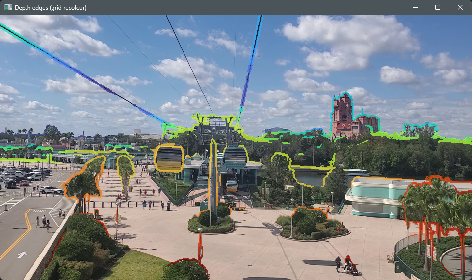
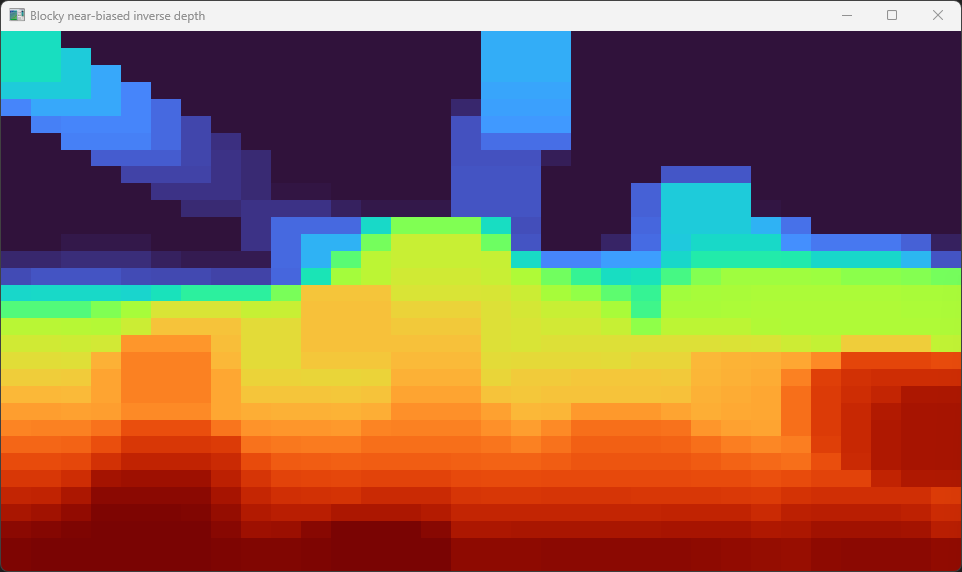
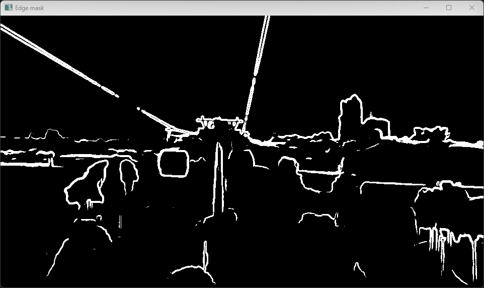

# Depth Edges Overlay (Depth Anything V2 + OpenCV)

This project captures frames from a webcam (or a video file), estimates a monocular depth map using [Depth Anything V2](https://github.com/DepthAnything/Depth-Anything-V2), extracts **depth discontinuity edges**, and overlays thick, coloured outlines onto the original video.

The outline colour encodes **relative depth** (not metres). The edge colouring is stabilised by deriving colours from a **coarse, neighbour-pooled depth grid**, while edge detection can optionally use **CLAHE** for stronger boundaries in low-contrast scenes (especially outdoors).

## What it does

- Runs Depth Anything V2 locally using PyTorch on CUDA.
- Builds a depth-based edge mask (Sobel gradients + threshold).
- Colours edges by depth and overlays them on the RGB frame.
- Uses a coarse grid for edge colouring (fast, reduces “background-coloured” thick outlines).
- Optional CLAHE step improves edge detection without distorting edge colours.

## Illustrations

Below is an image from a frame of video, illustrating how this tool can add coloured outlines around distinct objects in the scene, with the outline colour giving an indication of how far from the viewer each object is. Depth estimation uses Depth Anything V2 (a pretrained monocular depth estimation model) which isn't perfect (note it gets the cables wrong) but generally works well and is relatively fast.

Typically, the nearest objects will be highlighted in red, into oranges (further), and the farthest objects will be highlighed in blue, into green (nearer).



Below is a low-resolution representation of the sort of depth heatmap that is output from Depth Anything V2, using the colour sheme outlined above:



Finally, we have an illustration of the output from the edge-detection processing. This is performed on the heatmap to look for objects that are set-apart in distance from their surroundings.



## Requirements

- Windows 11 (tested setup), but the approach is OS-agnostic.
- Python 3.10 (recommended for this environment).
- NVIDIA GPU with a recent driver (tested with RTX 4060 Laptop GPU).
- Internet access on first run to download model weights.

## Quick start

### 1) Create and activate a venv

This repo is typically used from a MinGW64 bash shell on Windows, but it works from PowerShell too.

From MinGW64 bash:

```bash
python -m venv env
. env/Scripts/activate
python -m pip install --upgrade pip
```

### 2) Install PyTorch (CUDA)

This uses the official PyTorch CUDA wheel index:

```bash
pip install torch==2.9.0 torchvision==0.24.0 torchaudio==2.9.0 --index-url https://download.pytorch.org/whl/cu128
```

### 3) Install remaining dependencies

```bash
pip install opencv-python pillow transformers
```

### 4) Sanity check CUDA is visible to PyTorch

```bash
python -c "import torch; print(torch.cuda.is_available()); print(torch.version.cuda); print(torch.cuda.get_device_name(0) if torch.cuda.is_available() else None)"
```

You should see `True` and your GPU name.

## Running

Assuming your main script is `depth_edges.py` (rename as needed):

### Real-world example (using webcam 0 as input):

```bash
python depth_edges.py -s 0 -w -a 0.75 -b 3 -c -e 0.15 -g 32 -i 320 -t 0.5 -r 1
```

### Display help text

```bash
python depth_edges.py --help
```

### Webcam source

```bash
python depth_edges.py --source 0
```

### Video file source

```bash
python depth_edges.py --source path/to/video.mp4
```

### Save output as a video file

```bash
python depth_edges.py --source 0 --out out.mp4
```

### Useful options (typical)

* Show debug windows (edge mask, blocky depth grid):

  ```bash
  python depth_edges.py --source 0 --show-debug
  ```

* Improve edge detection in low-contrast scenes (recommended outdoors):

  ```bash
  python depth_edges.py --source 0 --contrast-boost
  ```

* Control inference speed/quality trade-off:

  ```bash
  python depth_edges.py --source 0 --infer-max-side 384
  ```

* Control edge sensitivity / thickness:

  ```bash
  python depth_edges.py --source 0 --edge-thresh 0.30 --dilate 2
  ```

* Control depth dynamic range allocation (prevents horizon dominating):

  ```bash
  python depth_edges.py --source 0 --knee-near-frac 0.25
  ```

* Zoom captured frames (applied immediately after capture):

  ```bash
  python depth_edges.py --source 0 --zoom 1.25
  ```

Tip: run `python depth_edges.py -h` to see the exact set of supported flags in your current version.

## Notes on model weights and licences

* The first run downloads the model checkpoint from Hugging Face and caches it locally.
* Depth estimation is **relative**: colours represent nearer/farther ordering, not physical distances.

## Troubleshooting

### `torch.cuda.is_available()` is False

* Check your NVIDIA driver is installed and up to date.
* Ensure you installed the CUDA-enabled PyTorch wheels (the `--index-url .../cu128` line).

### OpenCV window issues

If `cv2.imshow()` behaves oddly under MinGW64, try running the same command from PowerShell to confirm it is not a terminal integration issue.

### Path rewriting in MSYS/MinGW64

If you see weird path behaviour when passing file paths as arguments, you can disable MSYS argument conversion:

```bash
export MSYS2_ARG_CONV_EXCL="*"
```

## Project structure (typical)

* `depth_edges.py` – main script
* `env/` – Python virtual environment (local, not committed)
